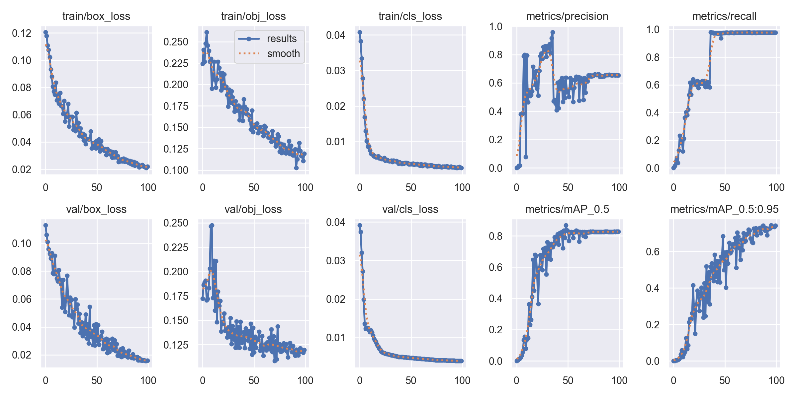
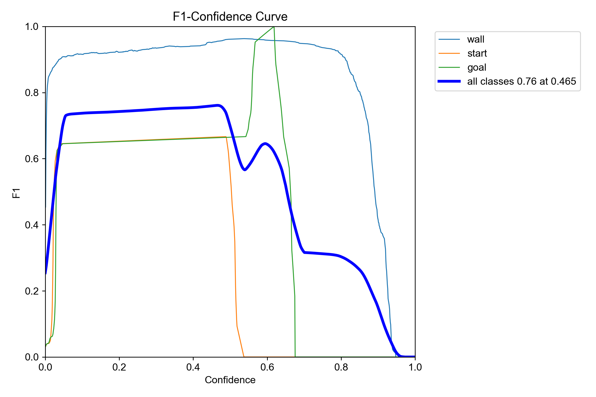
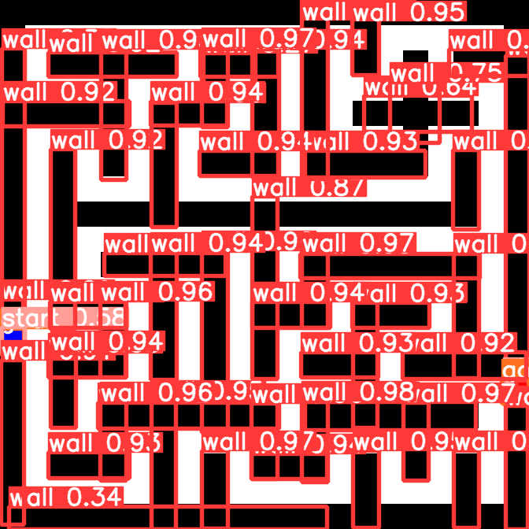
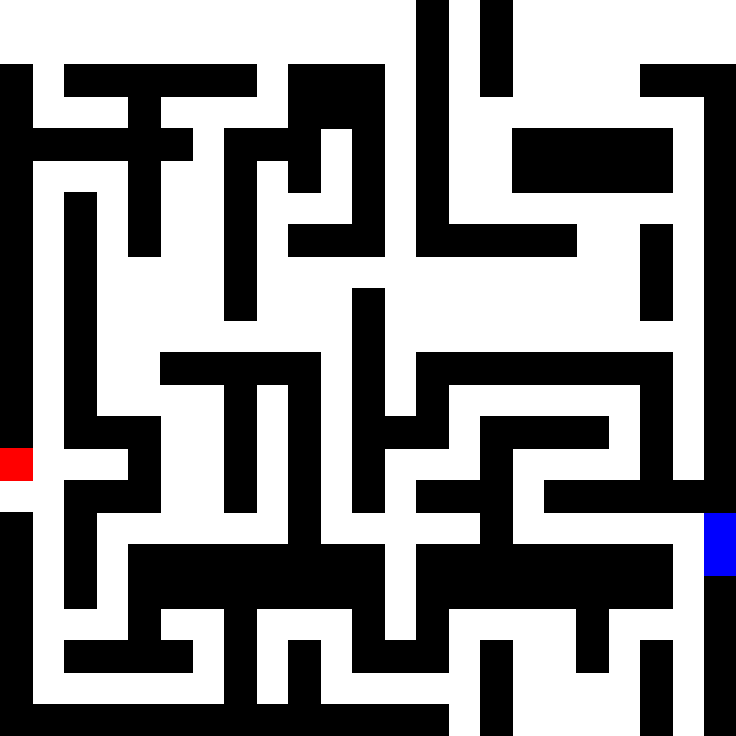
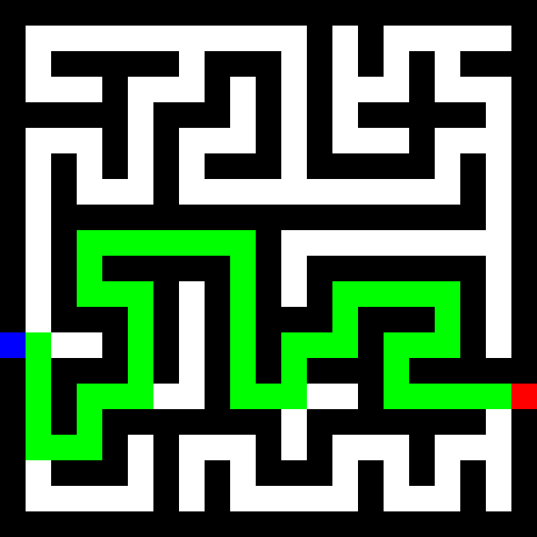

# 迷路画像自動探索

人工知能システム開発実習 小プロジェクト 2

OK240100 藤村勇仁

## 概要

迷路の画像を認識し、自動で探索するプログラムを作成した。
YOLO で壁とスタート(赤く色づけ)とゴール(青く色づけ)を認識させた。
その結果、単調で特徴の取りにくいものはうまく認識できないことが分かった。

## 背景

時間をかけないと解けないような迷路を瞬時に解けたらかっこいいと考えた。
また、今私たちが学んでいる知識を活かしてで解きたいと思ったため、YOLO でやることになった。

## 目的

画像認識で迷路を解析し、データ化する。そして、迷路データから最短経路を求める。

## プログラム

穴掘り法を持ちいて迷路を生成し(今回は$21\times21$にした)、それを画像として保存するとともにラベル付けもプログラムで行った。その後、それらを YOLO に学習させ、迷路画像に実行。それによって得られた壁とスタートとゴールの YOLO のラベルデータから迷路を復元し、それを幅優先探索で最短経路を求めた。

迷路の画像は、通路を白, 壁を黒, スタートを赤, ゴールを青で表した。
また、学習の段階で 32px の倍数に整えられるようなので、1 マス 32px にした。

ラベル付けでは、壁とスタートとゴールに対して行った。
壁を 1 マスづつラベル付けするだけでは認識がうまくできないと考え、連続するマスをまとめて長方形でラベル付けするようにした。

学習は、`python train.py --batch 10 --epochs 100 --data data/outdir.yaml --name outdir --img 672`で実行した。
672 は、$(迷路のサイズ)\times(1マスのサイズ) = 21 \times 32$

迷路を復元する際は、ピクセルサイズが 32px であることを考慮しつつ四捨五入するような形で行った。

## 結果

モデルの学習は以下のようになった。
(0.75)
(0.75)

認識の結果は以下のようになった。
(0.6)

認識の結果から解析した迷路画像は以下のようになった。
(0.6)

解析結果の迷路では不完全な迷路になってしまっているため、認識させた元の迷路画像に対して迷路の解析をし、復元した迷路データで最短経路を求めたものが以下である。
(0.6)

## 考察

グラフより、エポックは 100 で十分だと考える。
また、F 値を見るとゴールの F 値が上がるところでスタートの F 値が下がっている。このことより、スタートもゴールとして認識されてしまったのではないかと考える。

認識結果から解析した迷路画像が認識したラベルより乱れてしまっているのは、小数点を四捨五入せずに切り捨て(`int(1.23)`でキャスト)してしまっていたからだと考える。

今回の認識の精度の低さは、壁もスタートもゴールも単色の特徴が少ないものであったからだと考える。
そのため、それぞれを単色のピクセルではなく文字で表し、それを認識させることで精度が向上すると考える。

また、復元した際の画像の乱れは 1 マス 32px に落とし込む際の手法を精査することで改善されると考える。

## 自己採点について

今回の自己採点は 75 点であったが、これには以下の理由がある。

### github 使用のマニュアル作成

`README.md` に issue を出してブランチを切り、そこにコミットして PR を出してマージをするという手順を書いた。

~~やってくれなかったけど…~~

### 仕事量の比率

迷路作成プログラム, 画像生成とラベル付けプログラム, 迷路解析プログラム, メインプログラムを作成した。

チームメンバーには迷路探索プログラムと学習の実行、スライドの作成を任せた。

迷路探索プログラムは別のファイルとして作成してほしいと言っていたが、迷路生成プログラムの中に書いてしまったためファイルの切り分けも行った。

学習の実行は時間が無くなってきて、自分で実行するほうが早いので結局自分でやることになった。

また、発表も理解度の関係から自分がすることになった。

## 感想

悔しい結果になってしまった。もう一週間あればいろいろ試せたと思う。

チームで行う(それも少人数)ときはもう少し簡単な内容にしたほうがいいかもしれない。
自分ばかりがやることになって自分にもチームにもよくないと感じた。
