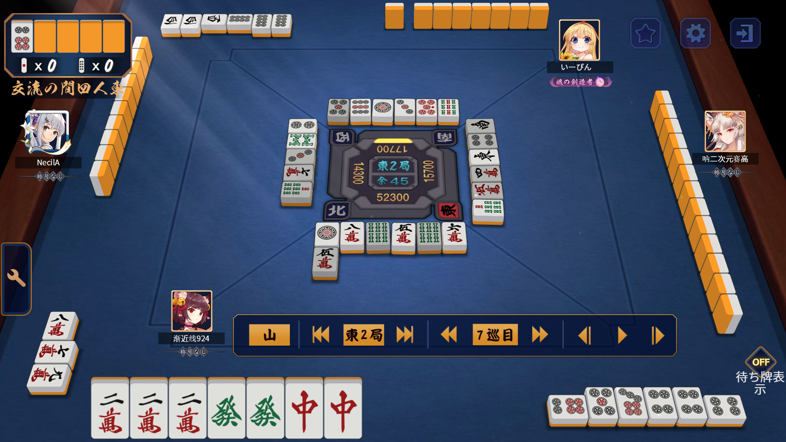

# 最終レポート

## 1. 要求仕様

### 1.1. 目的

麻雀における大変な作業を自動化したい。
難しいところを自動化することで、初心者でも楽しめるようにする。
&rarr;麻雀の~~点数計算~~, 安牌の推定, ドラの表示を自動化する。

### 1.2. システム概要

1. ネット麻雀のスクリーンショットを入力とする。
2. そのスクリーンショットに写っている牌を認識する。
3. 認識結果に基づいて
   - それぞれのプレイヤーに対する安牌を推定する。
   - ~~点数計算を行う。~~
4. 結果を出力する。
   ~~入力画像に色を付けたり枠を描画したりして、認識結果を表示する。~~
   テキストで結果を表示する。
5. ドラを表示する。

## 2. 概要設計

### 2.1. 学習データ

ネット麻雀のスクリーンショットを 4 つに分割して、それぞれの牌をラベル付けする。

もとはスクリーンショットをそのまま使用していたが、20 枚程度で学習を行ったところ、1 枚も認識されなかった。
&rarr;スクリーンショットを 4 つに分割することで、牌の大きさが大きくなるとともに画像の量も 4 倍になる。

その後、1 度４分割した画像でラベリングを行い、学習させる。そしてそのモデルを使用して全体画像を認識させ、手作業で修正を行うことで少ない労力でラベリングを行う。

### 2.2. 使用する技術

#### 学習データの作成

##### 画像の分割

python を使用して、スクリーンショットを 4 つに分割する。
画像情報を OpenCV で取得し、その配列のスライスを OpenCV で画像として保存する。

```python
import cv2
import os

# 画像を四つに分割して保存する
def split(img_path, save_dir="splitted_data"):
    if not os.path.exists(save_dir):
        os.makedirs(save_dir)
    img = cv2.imread(img_path)
    h, w = img.shape[:2]
    h = h // 2
    w = w // 2
    img1 = img[:h, :w]
    img2 = img[:h, w:]
    img3 = img[h:, :w]
    img4 = img[h:, w:]
    cv2.imwrite(
        os.path.join(save_dir, os.path.basename(img_path)).replace(".png", "_1.png"),
        img1,
    )
    cv2.imwrite(
        os.path.join(save_dir, os.path.basename(img_path)).replace(".png", "_2.png"),
        img2,
    )
    cv2.imwrite(
        os.path.join(save_dir, os.path.basename(img_path)).replace(".png", "_3.png"),
        img3,
    )
    cv2.imwrite(
        os.path.join(save_dir, os.path.basename(img_path)).replace(".png", "_4.png"),
        img4,
    )
```

##### ラベリング

LabelImg を使用して、画像にラベルを付ける。

#### 物体検出

YOLOv5 を使用する。

#### 画像の描画

~~OpenCV を使用する。~~

#### リアルタイム処理

~~ネット麻雀の画面を OBS でキャプチャし、仮想カメラとして出力することで OpenCV でフレームを取得する。~~

## 3. タスクとスケジュール

大まかにデータ準備, コーディング, グループ関係の３つに分け、各班員は自分が得意なものを担当した。

自分はコーディングを担当した。
場に出ている牌の取得、安牌の推定、自家の手牌と副露牌の取得、ドラの表示を行うコードを作成した。
リアルタイム処理や UI の実装、点数計算などは時間が足らず実装できなかった。

画像を分割するコードも作成した。
その際に、すでにラベル付けを終えたデータがあったので、それもラベルデータとともに 4 つに分割した。

## 4. 結果

### 4.1. 認識

350 枚の画像を用いて学習をエポック 800 で学習させたところ、それなりの精度で認識できたが、まだ十分とは言えない精度だった。
下家の副露牌や、萬子の牌の精度がとくに低かった。

### 4.2 解析

牌の解析では小明槓の解析の実装だけできなかった。そのほかの暗槓の裏面の部分を解釈する等の処理はできた。
自家の手牌と副露牌の解析の手段を以下に示す。

1. 手牌と副露牌をまとめた配列[class_id, x_center, width, height]を取得する。
2. x_center でソートする。
3. 次の牌との間隔を見て、１番間隔が広いところから右が副露牌と判断する。その際に、縦横比から倒れているかどうかを判定して配列[class_id, is_tapped]として保存する。
4. 副露牌の解析（チー, ポン, カン）
   1. 副露牌の背面の牌の数から暗槓の数を推定する。
   2. 今回の暗槓は背面の牌に挟まれる形であるため、背面の牌から４つの牌をカンとして取り除く。
   3. その後、残った牌をチーとポンと大明槓に分ける。
      1. 副露牌を先頭から３つを今のブロック、次の３つを次のブロックとして取得し、それぞれのブロックに倒れている牌がいくつあるかを数える。その際にブロックごとに class_id でソートする。
      2. 今のブロックに倒れている牌がないなら、次の牌を含んだ４つで大明槓である。
      3. 今のブロックに倒れている牌がある。
         1. 今のブロックの class_id が連続するなら、チーである。
         2. 今のブロックの class_id が同じなら、ポンか大明槓である。
            1. 次のブロックがないなら、ポンである。
            2. 次のブロックがある。
               1. 次のブロックに倒れている牌がない。
                  1. 今のブロックの class_id と次の牌の class_id が同じなら、カンである。

安牌の推定は、他家が捨てた牌を元に、それぞれのプレイヤーに対する安牌を推定する。

例として入力画像とそれに対する出力を以下に示す。
ただし、認識は完ぺきにできたとしてそれに対しての解析結果である。



```shell
--------------------------------------------------

それぞれのプレイヤーの捨て牌は以下の通りです

自家: m5 2, m6 1, m8 1, s6 2, p1 1,
下家: m4 1, m5r 1, s7 1, p4 1, east 1, south 1,
対面: s9 1, p1 1, p3 1, p5 1, p9 1, p5r 1,
上家: m7 1, s7 1, s8 1, p2 1, p3 1,

--------------------------------------------------

他家に鳴かれた牌は以下の通りです

m7 1, m8 1, m9 1, p8 3, west 3,

--------------------------------------------------

ドラ表示牌は以下の通りです

p6 1,

--------------------------------------------------

ドラは以下の通りです

p7 1,

--------------------------------------------------

四枚見えている牌は以下の通りです

p4,

--------------------------------------------------

自家の手牌は以下の通りです

m2, m2, m2, green, green, red, red,

--------------------------------------------------

自家が鳴いた牌は以下の通りです

チー: [p5, p6, p7, ], ポン: [p4, p4, p4, ],

--------------------------------------------------

それぞれのプレイヤーに対する安牌は以下の通りです

下家:
対面:
上家:

--------------------------------------------------
```

## 5. 考察

### 5.1. 認識

全体の精度が十分でなかったのは、学習させたデータと認識させたデータの大きさが違ったからだと考える。

下家の副露牌の認識精度が低かったのは、四角形の形が正面からでなく斜めから写っていてかつ、サンプルの数が少ないためだと考えられる。

また、萬子の牌の認識精度が低かったのは、萬子の牌には共通して同じ位置に"萬"という字が入っているからだと考える。

### 5.2. 解析

全体的に時間が足らず満足いく結果にはならなかった。

実装後のテストも十分に行えていないため、バグがまだまだあると考えられる。

## 6. 改善点

### 6.1. 認識

画像は一定の傾きで変形しているため、画像のパースを事前に行う。

また、牌が置かれる領域は決まっているため、その部分だけ切り取って認識させることも有効だと考える。

### 6.2. 解析

小明槓の解析は、x_center でソートした後に、隣り合う牌の間隔を見て、それが一定以下の間隔であれば小明槓であると判断することで実装できると考える。

点数計算は、点数の大きい役から順に判定していくことで実装できると考える。

UI は、簡単なものであれば OpenCV で入力画像の上に色付けすることで実装できると考える。
オーバーレイのようなものであれば、PyQt や PySide を使用することで実装できると考える。

## 7. 自分のチームへの貢献度の理由

上述の通り、コーディングはすべて自分が行った。
しかし、元々やろうと考えていたことがすべてできたわけではなかった。
また、ラベリングや学習、発表準備などは他のメンバーが行った。
ただ、ラベリングや学習にもアドバイスをしたり、GitHub の使い方講座を行ったりした。

これらの理由より、自分のチームへの貢献度は 55% と考える。
